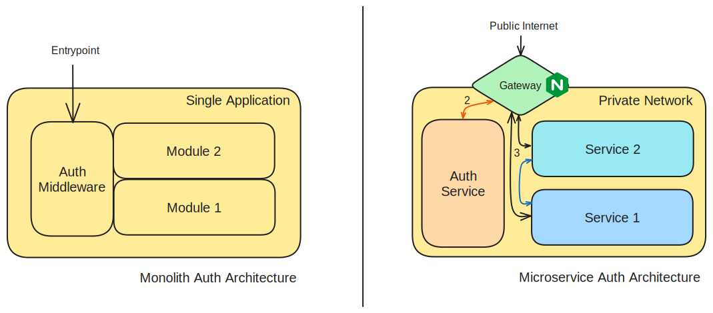

# Microservice Auth for Beginners - 1

## Microservices

Microservice, a word that is often heard in the tech world. You need scalable solution? Upgrade to microservice. You need to control individual modules? Upgrade to microservice. But with fewer amount of resources available with proper guidelines to truly implement microservice, there is unforeseen headache in all the way.

Most of us think microservice as different backend instances running for different module. It's just tip of the iceberg. There is much more to this architecture than just splitting the backend into different parts. To harness the power of microservice, we need to think in a distributed manner, rather than the traditional approach. It includes separation of datasource, interservice communication, managing these individual services, separation of authentication and authorization, and many more.

In the upcoming series of blog, I will try to explain the common problems that we faced during my time at Pridesys IT Ltd. trying to implement microservice and what are the approaches we followed to overcome that. In today's blog, I will try to explain the authentication and authorization process in a microservice architecture for smooth operation.

## Auth - Authentication and Authorization

One of the most common parts of any application is authentication and authorization. Authentication is identifying the user who is trying to access the application and authorization is checking if the user has permission to access/modify a resource. These two processes ensure system security by controlling what is accessible by whom, and combinedly we will refer these as **auth**.

In monolith web architecture, there is usually a middleware/interceptor that is responsible for handling auth and maintaining secured API endpoints. For example, using spring security, we might need to use filters to verify one's identity and access at each request. HTTP protocol is stateless, that is no information is preserved from one call to another. For that reason, everytime before serving a request, authenticity is verified. That is true for all kinds of authentication - Basic, Session based or Token based.

In microservice architecture, services are split up to different services. But ensuring security is a common part for all of them. One might choose to add authentication handling at each services separately, but this is a very bad practice. One of the core principle of clean coding is DRY.

>  **DRY** - Don't Repeat Yourself

If we need to change the implementation / refactor / fix security issues of our auth in future, we need to change code in each and every services, which is not feasible. 

For this reason, typically there exists at least one service only to handle authentication and authorization. The implementation of this could be as simple as basic auth or complex with many permissions and role-based authentication. But the issue that arises with this approach is how other microservices can use that auth service. 

One approach could be using REST API calls from other services to auth service to verify one's identity and access. But again, it will involve more complexity that needs to be addressed. Every microservice needs to have same kind of code for authentication. Moreover, if we use REST API call for interservice communication, there will be redundent authentication checks which will decrease the overall performance of the system.

To mitigate these issues, we divide our domain into two spaces - public and private; and an application gateway is used to conduct communication from public domain to private domain.



## Application Gateway

Application gateway is a separate server/service that works as a firewall to enable secured access to internal services. It can also be used to limit rate for particular IP. Again, since all external communication is routed via the application gateway, it could be a good place to integrate authentication and authorization. Communication inside the private domain is trusted, so no double checking is done for interservice communication. We can also keep some service truly private without exposing that using the application gateway, and it can only be used by other services. Application gateway acts as a reverse proxy to communicate with the exact service that is needed from outside.

The idea behind the application gateway is simple, we can use our own implementation using any preferred language. One can use express.js or flask for that. But, we need to keep in mind that, all external communication is done via that application gateway. So, the server needs to handle combined load of the whole microservice. Implementation with single threaded high level language could introduce bottleneck in performance. And there could be security vulnerabilities if not handled properly.

For that case, it is better to use a proven application gateway, and the most widely used open-source implementation is **NGINX**.

## NGINX

Nginx is a web server that can also be used as a reverse proxy, load balancer, mail proxy and HTTP cache. It is highly scalable, performant and widely used as application gateway. According to [one of the blogs](https://blog.nginx.org/blog/testing-the-performance-of-nginx-and-nginx-plus-web-servers) on performance testing, one nginx instance can handle more than *500,000 requests per second* for a typical response (1-10kB) in 8-16 core CPU. To get a quick overview of NGINX, take a look at the [video by TechWorld with Nana](https://youtu.be/iInUBOVeBCc).

In today's blog our main goal will be to use NGINX as application gateway with authentication support for a simple microservice application. It will be consisting two different parts of deployment -

1. NGINX in docker compose (covered in this blog)

2. NGINX with ingress in kubernetes (next part of the blog)

NGINX uses a `conf` file to configure the web server. For the docker compose, we will directly modify the configuration file ourselves. In case of kubernetes, we just need to add directives in the ingress manifest, and the NGINX ingress controller will be configured automatically.

Without further ado, lets dive into the implementation of microservice authentication.

## Microservices

We will use two simple microservices, built with Express JS, to simulate microservice along with another auth service for basic authentication.

Initialize a Node JS application with Express JS

```bash
npm init -y
npm i express
```

Add three files for three services

1. `auth.js`
   
   There is only one endpoint, `GET /validate`, which checks if the user has provided basic authentication password as `password`. Note that, the username is sent to the response via `User` header. Authentication endpoint can relay information to the next API endpoint via headers only, response body will not be used. Whether a request should be allowed to pass to a secured service is determined by the response status of the validation endpoint. Only responses with `2xx` code is allowed to pass on to the next level. In the following case, we have sent `204` and `401` for successful and unsuccessful login attempts respectively.
   
   ```js
   const express = require("express");
   const app = express();
   
   app.get("/validate", (req, res) => {
     const authheader = req.headers.authorization;
   
     if (!authheader) {
       res.setHeader("WWW-Authenticate", "Basic");
       return res.sendStatus(401);
     }
   
     const [user, pass] = new Buffer.from(authheader.split(" ")[1], "base64")
       .toString()
       .split(":");
   
     if (pass !== "password") {
       res.setHeader("WWW-Authenticate", "Basic");
       return res.sendStatus(401);
     }
   
     res.setHeader("User", user);
     res.sendStatus(204);
   });
   
   app.listen(3000, () => {
     console.log("Server is Running");
   });
   ```

2. `service-1.js`
   
   This is a simple service that uses the user information relayed by the auth service to show different messages to admin and other users at `GET /hello` API endpoint.
   
   ```js
   const express = require("express");
   const app = express();
   
   app.get("/hello", (req, res) => {
     const user = req.headers.user;
     if (user === "admin") {
       return res.send(`Hello, ${user}!`);
     } else {
       return res.send(`Welcome, ${user}!`);
     }
   });
   
   app.listen(3000, () => {
     console.log("Server is Running");
   });
   ```

3. `service-2.js`
   
   This service demonstrates interservice synchronous communication over HTTP, from service-2 to service-1.
   
   ```js
   const express = require("express");
   const app = express();
   
   const SERVICE_1 = process.env.SERVICE_1 || "http://localhost:3000";
   
   app.get("/echo", (req, res) => {
     const headers = req.headers;
     fetch(SERVICE_1 + "/hello", {
       headers,
     })
       .then((response) => {
         return response.text();
       })
       .then((text) => {
         res.send(`[${text}]`);
       })
       .catch((err) => {
         res.send("Error in fetching data from service 1");
       });
   });
   
   app.listen(3000, () => {
     console.log("Server is Running");
   });
   ```

We can check these servers are working perfectly by running the servers and making request with `curl`.

```bash
node service-1.js
curl -H "User: admin" http://localhost:3000/hello
```

We can also build docker images for these three services separately, eg `Dockerfile.auth-service`:

```dockerfile
FROM node:20-alpine
COPY . /app
WORKDIR /app
RUN npm i
EXPOSE 3000
# can be "service-1" or "service-2"
CMD ["node", "auth.js"]
```

In the repository, I have kept three different dockerfile to build images from:

```bash
docker build -f Dockerfile.auth-service -t auth-service .
docker build -f Dockerfile.service-1 -t service-1 .
docker build -f Dockerfile.service-2 -t service-2 .
```

We can run these services separately by the following commands:

```bash
docker run -p 3000:3000 auth-service
docker run -p 3001:3000 service-1
docker run -p 3002:3000 -e SERVICE_1=http://localhost:3001 service-2
```

## Docker Compose with Private Domain

For now, we have directly run our service using docker. We will now use NGINX to enable authentication for each microservices. 

Docker compose for running these four services (3 microservices + 1 nginx), `docker-compose.yaml`

```yaml
services:
  auth:
    build:
      context: .
      dockerfile: Dockerfile.auth-service
    networks:
      - private-domain
  service-1:
    build:
      context: .
      dockerfile: Dockerfile.service-1
    networks:
      - private-domain
  service-2:
    build:
      context: .
      dockerfile: Dockerfile.service-2
    environment:
      - SERVICE_1=http://service-1:3000
    networks:
      - private-domain
  nginx:
    image: nginx:alpine
    ports:
      - "3000:3000"
    volumes:
      - ./nginx.conf:/etc/nginx/conf.d/default.conf
    depends_on:
      - auth
      - service-1
      - service-2
    networks:
      - private-domain

networks:
  private-domain: {}
```

We have created a virtual network called `private-domain` which has only exposed endpoint via the nginx service by port `3000`. All API endpoints are called using this exposed port.

NGINX uses a `conf` file for configuration. For our three services to work properly, we will use the following configuration file, saved as `nginx.conf`

```nginx
upstream auth {
    server auth:3000;
}

upstream service-1 {
    server service-1:3000;
}

upstream service-2 {
    server service-2:3000;
}

server {
    listen 3000;
    server_name localhost;

    location /auth-validate {
        internal;
        proxy_pass http://auth/validate;
    }

    location /service-1/ {
        auth_request /auth-validate;

        auth_request_set $user $upstream_http_user;
        proxy_set_header user $user;
        
        proxy_pass http://service-1/;
    }

    location /service-2/ {
        auth_request /auth-validate;

        auth_request_set $user $upstream_http_user;
        proxy_set_header user $user;
        
        proxy_pass http://service-2/;
    }
}
```

For a brief explanation, `upstream` sets the server location to use within the nginx configuration. We create three entries for three services. `server` block contains the configuration to nginx server with its `listen` -ing port and API endpoints for different services using `location`. Note at the extra slash at the end of `service-1/` or `service-2/`. This allows prefix matching instead of exact matching. So we will be able to access `/service-1/hello` without explicitly declaring it as a `location`.

We have marked `/auth-validate` to be an `internal` location, it will not be accessible from outside of nginx. For `service-1` and `service-2`, we have used the `/auth-validate` endpoint to validate incoming request before passing to actual service. We have also read the header value of `User` from `auth-service` using `auth_request_set` and used that value to set `User` header before calling the actual service.

Directory structure for all these files:

```
0-auth
├── Dockerfile.auth-service
├── Dockerfile.service-1
├── Dockerfile.service-2
├── auth.js
├── docker-compose.yaml
├── nginx.conf
├── package-lock.json
├── package.json
├── service-1.js
└── service-2.js
```

After all these configuration are set, we can run the project using:

```bash
docker compose up -d
```

### Testing out the authentication

We will use curl to test endpoints:

```bash
# Ok
curl -L -u admin:password http://localhost:3000/service-1/hello
curl -L -u user:password http://localhost:3000/service-1/hello
# 401 Unauthorized, Password mismatch
curl -L -u admin:12345678 http://localhost:3000/service-1/hello

# Ok
curl -L -u admin:password http://localhost:3000/service-2/echo
# 401 Unauthorized, Authentication was not provided
curl -L http://localhost:3000/service-2/echo

# 404 Not Found, Internal Service
curl -L http://localhost:3000/auth-validate
```

In the next part, we will deploy these services in kubernetes.

## Codebase

The full code can be found in [this git repository](https://github.com/MJKSabit/microservice-for-beginners/tree/master/0-auth).

## Credits

Thanks to all my team members: Hasan Masum, Iftekhar E Mahbub Zeeon, Fardin Anam Aungon, Tamim Ehsan, Akibur Rahman and Anup Bhowmik.
